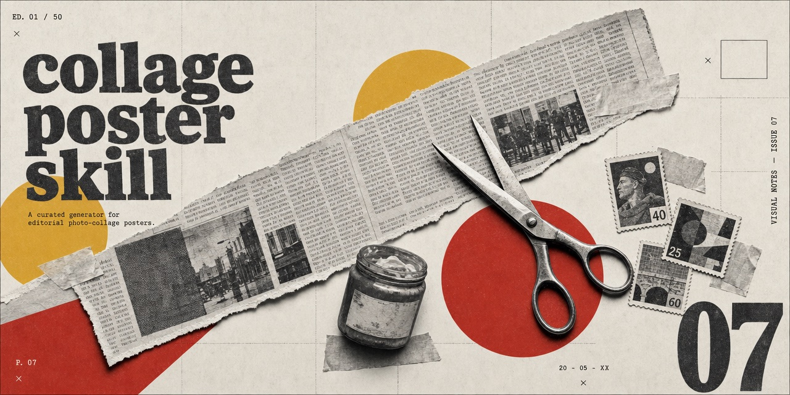
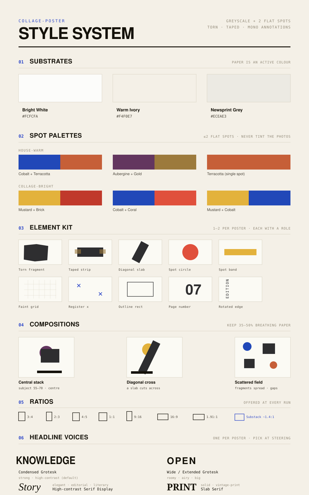
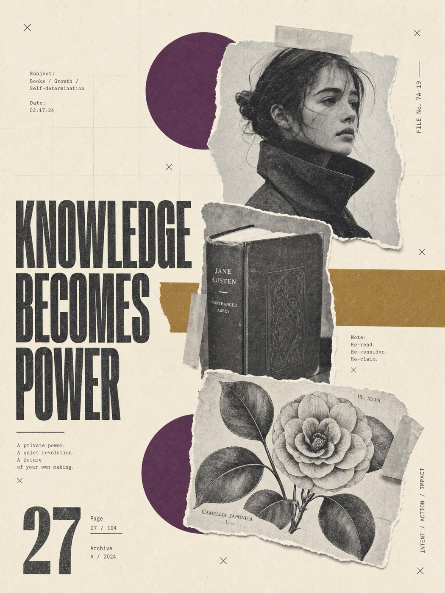
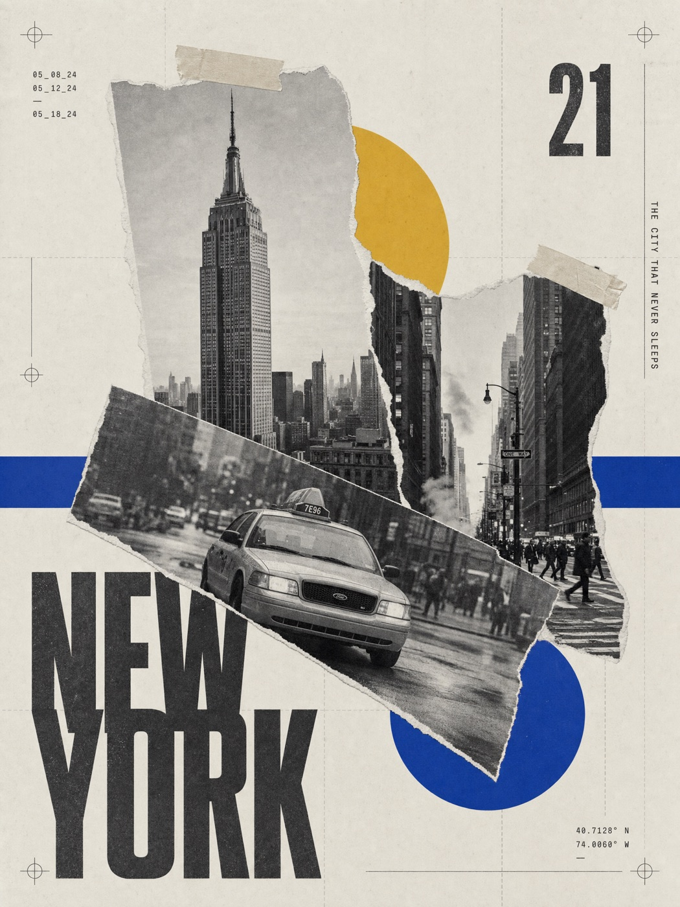
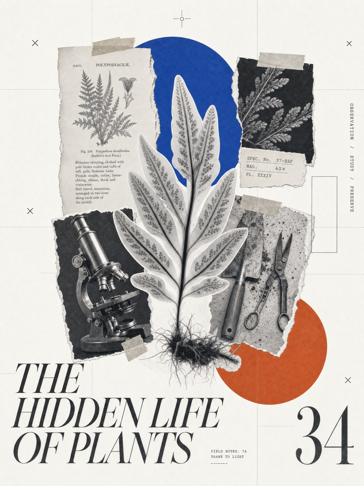

# collage-poster



A curated skill that generates **contemporary editorial photo-collage posters** — greyscale photographic fragments with up to two flat spot colours on near-white paper, torn-and-taped edges, a faint modular grid, register marks, and mono annotations. Pick a spot palette, composition, and ratio; it composes an original poster prompt for any subject.

A **single-style, parametric generator**: the style is fixed, while the subject, palette, composition, elements, and ratio vary — so the look reproduces reliably across briefs.

> _Built with AI assistance (Claude Code). The design system and creative decisions are human-directed; the example images are AI-generated._

## What it makes

- Greyscale photographic collage — torn fragments, taped strips, overlapping layers, photocopy grain.
- **At most two flat spot colours** as shapes (circles, bands) behind the fragments — never tinting the photos.
- Faint modular grid, small "x" register marks, thin outline rectangles, a large page-style number.
- A headline in one of four display voices (condensed grotesk / wide grotesk / serif display / slab) + small monospaced annotations you can set, randomise, or omit.

It produces a final image-generation prompt (and the image itself when an image tool is available). It does **not** clone any specific existing poster.

## Using the output

The skill's core deliverable is a **ready-to-paste image prompt**. It stays tool-agnostic — copy the prompt into whatever image generator you use:

- **OpenAI** (ChatGPT / DALL·E / the images API)
- **Midjourney**
- **Google** (Gemini / Imagen)
- **Stable Diffusion**, Adobe Firefly, or any other text-to-image tool

If your agent already has an image-generation tool connected, it will render the poster directly; otherwise it hands you the prompt to paste in yourself. Aspect ratios are given as plain values (e.g. `3:4`, `16:9`) — map them to your tool's own flag or field (Midjourney's `--ar 3:4`, an aspect-ratio picker, etc.).

## Install

Place the folder where your agent's skills live:

```
~/.claude/skills/collage-poster/
├── SKILL.md
└── design-system/system.json
```

Then just ask for a collage poster (e.g. "做一張拼貼海報，主題是…", "collage poster of…"), or invoke `/collage-poster`.

## Design system

All parameters live in [`design-system/system.json`](design-system/system.json) — the source of truth.

| Dimension | What's in it |
|---|---|
| **Substrates** (3) | Bright White · Warm Ivory · Newsprint Grey |
| **Spot palettes** (6) | *house-warm*: cobalt+terracotta, aubergine+gold, terracotta-mono · *collage-bright*: mustard+brick, cobalt+coral, mustard+cobalt |
| **Elements** (10) | torn photo fragment, taped strip, diagonal slab, flat spot circle, flat spot band, faint grid, register marks, outline rectangle, page number, rotated edge text |
| **Compositions** (3) | central stack · diagonal cross · scattered field |
| **Headline voices** (4) | condensed grotesk · wide grotesk · serif display · slab serif |
| **Ratios** (8) | 3:4, 2:3, 4:5, 1:1, 9:16, 16:9, 1.91:1, and a Substack cover (14:10 / ~1.4:1, 1456×1048) |

The greyscale photographic base is a **constant**; colour lives only in the flat spot shapes.



## How it works

1. **Inputs** — subject, headline/labels, intent/ratio.
2. **Steering** — before composing, the skill surfaces the meaningful choices (**headline voice**, spot palette, composition, substrate, **ratio**, and the **numbers/dates** — set them, randomise, or omit) as a picker with a recommended default, so you steer instead of getting a black box.
3. **Assembly** — resolves the palette, composition ratios, and element mix from `system.json`; keeps 35–50% breathing paper and one orientation event.
4. **Prompt compiler** — five compact paragraphs describing only visible outcomes.
5. **Self-check** — a one-line gate (greyscale photos, ≤2 spots, breathing white, generic annotations, verbatim headline).

## Originality & annotations

- Recombines into a new composition every time; never reproduces a specific poster's layout, lettering, or marks.
- All annotations (dates, index, edge labels, page numbers) are **generic** editorial marks — never a real brand, handle, URL, or a fact invented as if true.

## Examples

Sample prompts the skill produces (paste into any image tool). Each uses a different palette, composition, and headline voice.

<table>
<tr>
<td width="33%"></td>
<td width="33%"></td>
<td width="33%"></td>
</tr>
<tr>
<td align="center"><b>Literary</b></td>
<td align="center"><b>City</b></td>
<td align="center"><b>Botanical</b></td>
</tr>
</table>

**Literary** — aubergine + gold, warm ivory, scattered field, condensed grotesk headline:

```text
Vertical 3:4 collage poster, warm ivory paper #F4F0E7. Greyscale photographic collage — a girl in a high-collar coat, an antique clothbound novel, and a copper-engraved camellia — as torn taped fragments with photocopy grain. Two flat spot colours only: aubergine #63365F and muted gold #9C7A3C, as flat circles and a band behind the photos, never tinting them. Scattered fragment field, ~45% breathing paper; a faint grid, small "x" register marks, a large page number. Bold condensed grotesk headline "KNOWLEDGE BECOMES POWER" left-anchored; small mono labels and a rotated edge tag. Torn/taped edges, matte print. No colour in the photos, no third spot, no real logos/brands/URLs.
```

**City** — mustard + cobalt, newsprint grey, diagonal cross, condensed grotesk headline:

```text
Vertical 3:4 collage poster, newsprint-grey paper #ECEAE3. Greyscale photographic collage of a city — a landmark tower, a street scene, a taxi — torn and taped with print grain. Two flat spots only: mustard #E3B23C and cobalt #2148B8, as flat circles and bands behind the photos. Diagonal-cross composition: one photo slab cuts across; ~35% breathing paper; faint grid, register marks, a large page number. Bold condensed grotesk "NEW YORK" bottom-left crossed by the slab; small mono dates and a rotated edge label. Torn edges, matte. Photos stay greyscale, no third spot, no real logos/brands/URLs, no license plates.
```

**Botanical** — cobalt + terracotta, cool white, central stack, serif display headline:

```text
Vertical 3:4 collage poster, cool-white paper #F7F7F4. Greyscale photographic collage — a rabbit's-foot fern as an X-ray silhouette, an antique botany book, a microscope, gardening tools — torn taped fragments with grain. Two flat spots only: cobalt #2148B8 and terracotta #C65F38, as flat circles behind the photos. Central-stack composition, ~40% breathing white; faint grid, "x" marks, a large page number. Elegant high-contrast serif display headline "THE HIDDEN LIFE OF PLANTS" anchored to a corner; small mono scientific marks (specimen no., "40×", plate no.) and a rotated edge tag. Torn/taped edges, matte. Greyscale photos only, no third spot, no real logos/brands/trademarks.
```

## License

Released under the [MIT License](LICENSE) — use, modify, and share freely, keeping the copyright notice.
